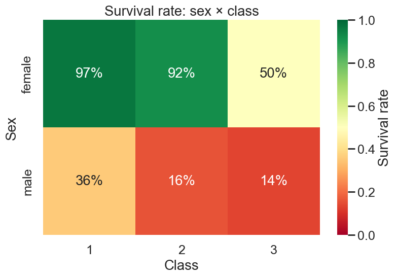
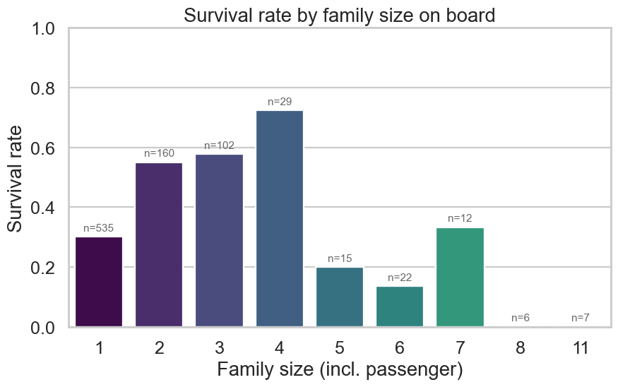
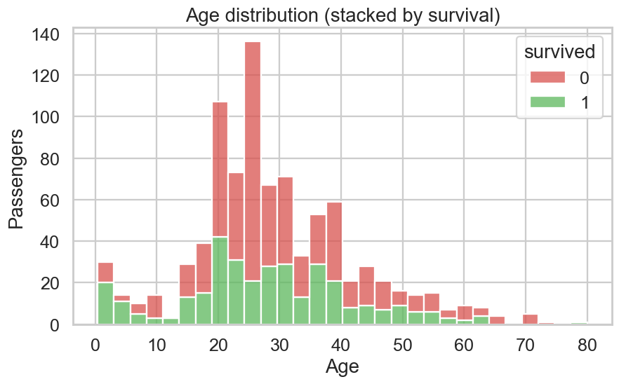
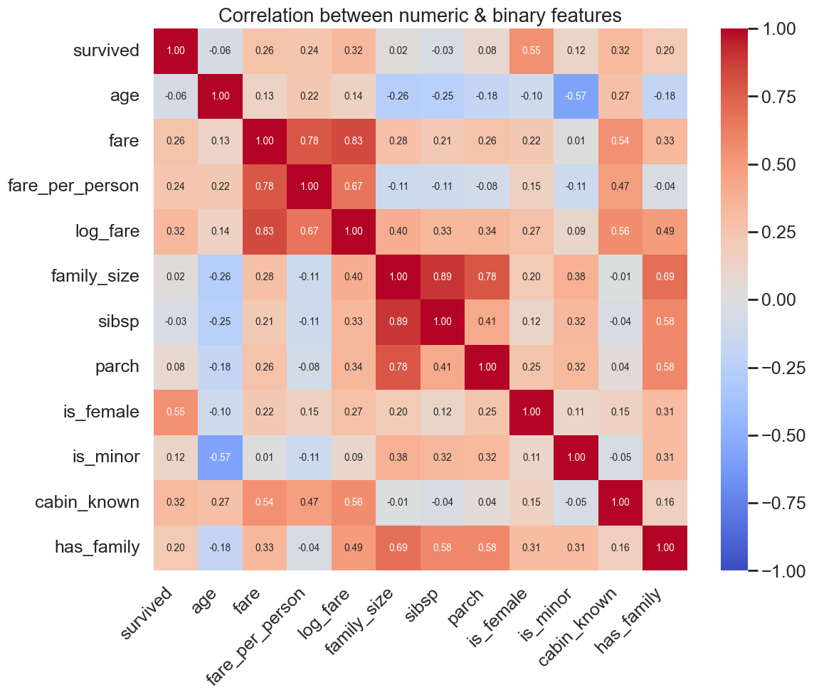

# 🐼 Data Explorer Panda

A small, self-contained data analytics project that loads, cleans, analyzes,
and visualizes the **Titanic** dataset, then displays the results in a
React dashboard.

Built end-to-end as a learning exercise to practice **pandas + seaborn**
on the backend and **React + Vite** on the frontend, with a deliberately
simple "static artifacts" architecture in between.

---

## What it does

1. Loads the Titanic dataset (~900 passengers, 15 columns)
2. Cleans missing values using group-wise medians
3. Engineers new features (age groups, family size, fare per person)
4. Computes group comparisons, crosstabs, and correlations
5. Generates 7 charts (PNG) covering distributions, comparisons, trends, and correlations
6. Exports everything into a single `insights.json` consumed by the React dashboard

The dashboard shows headline metrics, dataset overview, key findings,
all 7 visualizations, and the underlying data tables.

It also includes an **Upload & Clean** tab where you can upload your own
CSV: pandas inspects it, suggests cleaning steps, you accept/reject each
one (or add your own), then download the cleaned result.

---

## Tech stack

| Layer | Tool | Role |
|---|---|---|
| Data loading | **pandas**, seaborn (dataset only) | Load + cache the raw CSV |
| Data cleaning | **pandas**, numpy | Impute, drop redundant cols, feature engineer |
| Analysis | **pandas** | Groupby, crosstab, summary stats, correlations |
| Charts | **matplotlib**, **seaborn** | Static PNG visualizations |
| Export | stdlib `json` | One file: `insights.json` |
| Frontend | **React 18**, **Vite 5** | Dashboard SPA |
| Styling | Plain CSS Modules | Zero CSS dependencies |

---

## Architecture

```
seaborn ──▶ raw CSV ──▶ cleaned CSV ──▶ analysis ──▶ charts/*.png
                                              │
                                              └─▶ insights.json
                                                       │
                                          npm run sync │
                                                       ▼
                                          frontend/public/  ──▶  React reads it
```

Key design choice for the **Dashboard / Pipeline** tabs: no API server.
The backend writes static files, a tiny npm script copies them into the
frontend's `public/` directory, and the JSON schema is the contract.

The **Upload & Clean** tab is the one exception: it needs runtime pandas
(arbitrary user CSVs can't be pre-baked), so it talks to a small FastAPI
service at `localhost:8000`. Vite proxies `/api/*` there during dev.

---

## Folder structure

```
DataExplorerPanda/
├── README.md
├── .gitignore
│
├── backend/
│   ├── requirements.txt
│   ├── data/
│   │   ├── raw/titanic.csv              ← cached on first run
│   │   └── processed/titanic_clean.csv  ← after cleaning
│   ├── outputs/
│   │   ├── charts/                      ← 7 PNG charts
│   │   └── insights.json                ← consumed by React
│   └── src/
│       ├── load_data.py     # Phase 1 — load + cache raw CSV
│       ├── clean_data.py    # Phase 2 — impute + feature engineering
│       ├── analyze.py       # Phase 3 — groupby, crosstabs, correlations
│       ├── visualize.py     # Phase 4 — chart generation
│       ├── export.py        # Phase 5 — orchestrates everything + writes JSON
│       ├── suggest_clean.py # Upload & Clean — suggestion engine + step applier
│       └── api.py           # Upload & Clean — FastAPI service
│
└── frontend/
    ├── package.json
    ├── vite.config.js
    ├── index.html
    ├── scripts/
    │   └── sync-backend-outputs.js      ← auto-runs on `npm run dev` / `build`
    ├── public/                          ← synced from backend/outputs
    └── src/
        ├── main.jsx
        ├── App.jsx                      ← single fetch, dispatches props
        ├── index.css                    ← dark theme tokens
        └── components/
            ├── KeyMetrics.{jsx,module.css}
            ├── DatasetOverview.{jsx,module.css}
            ├── KeyFindings.{jsx,module.css}
            ├── ChartsGrid.{jsx,module.css}
            └── TablesGrid.{jsx,module.css}
```

---

## Setup

**Prerequisites:** Python 3.10+ and Node 18+ (tested on Python 3.13 / Node 20).

### Backend

```bash
cd backend
python3 -m venv .venv
source .venv/bin/activate
pip install -r requirements.txt
```

### Frontend

```bash
cd frontend
npm install
```

---

## How to run

> **You need two terminals open at the same time** — one for the API
> server (used by the Upload & Clean tab) and one for the Vite dev server.
> Skipping the API terminal is the most common cause of `HTTP 500` errors
> on the Upload tab: Vite's proxy can't reach `localhost:8000` and bubbles
> a 500 back to the browser.

### 1. (One-time) Generate the Titanic insights

```bash
cd backend
source .venv/bin/activate
python src/export.py
```

This runs the full pipeline (load → clean → analyze → visualize → export) and
writes:

- `backend/data/processed/titanic_clean.csv`
- `backend/outputs/insights.json`
- `backend/outputs/charts/*.png` (7 files)

Only needed when you change the backend pipeline — the artifacts are
checked-in / cached.

### 2. Terminal A — API server (FastAPI / uvicorn)

```bash
cd backend
source .venv/bin/activate
uvicorn api:app --app-dir src --reload --port 8000
```

You should see `Uvicorn running on http://127.0.0.1:8000`. Smoke-check:

```bash
curl http://localhost:8000/api/health   # → {"ok":true,"sessions":0}
```

### 3. Terminal B — Vite dev server (React)

```bash
cd frontend
npm run dev
```

Opens [http://localhost:5173](http://localhost:5173). The `predev` hook
auto-copies backend outputs into `frontend/public/` before starting Vite.
Vite proxies `/api/*` → `http://localhost:8000`, so the frontend talks to
the API as if it were same-origin.

If you re-run the backend pipeline, just refresh the page (or run
`npm run sync` to be explicit).

### Running individual phases

Each backend script is independently runnable, which makes them great for
poking around while learning:

```bash
python src/load_data.py     # Phase 1 — prints dataset overview
python src/clean_data.py    # Phase 2 — prints before/after of cleaning
python src/analyze.py       # Phase 3 — prints every analysis table
python src/visualize.py     # Phase 4 — regenerates all 7 charts
python src/export.py        # Phase 5 — chains all of the above + writes JSON
```

---

## Example outputs

### Headline metrics

| Metric | Value |
|---|---|
| Total passengers | 891 |
| Survival rate | **38.4%** |
| Average age | 29.1 |
| Average fare | $32.20 |
| Female passengers | 35.2% |
| 1st-class passengers | 24.2% |

### Key findings (auto-generated from the data)

1. Overall survival rate was 38% (342 of 891 passengers).
2. Women survived at 74%, men at 19% — a 55-point gap.
3. 1st-class passengers survived at 63%, vs 24% for 3rd class.
4. The strongest pattern: 1st-class women survived at 97%; 3rd-class men at 14%.
5. Families of 2–4 survived better than singles or very large families — a non-linear effect.
6. Fare correlates positively with survival (+0.26), mostly as a proxy for class.

### Sample charts

| Survival by sex × class | Survival by family size |
|---|---|
|  |  |
| The single strongest stratifier in the data. | Sweet spot at family size 2–4. |

| Age distribution | Correlation matrix |
|---|---|
|  |  |

(All 7 charts live in `backend/outputs/charts/`.)

---

## Learning goals

This project is structured around practicing each layer in isolation, then
wiring them together.

**Data engineering with pandas**
- Group-wise median imputation (e.g. fill `age` by `(pclass, sex)`)
- Feature engineering with `pd.cut` and arithmetic on existing columns
- Groupby + crosstab as primary analysis tools
- Pearson correlations on numeric features

**Visualization with matplotlib + seaborn**
- Picking the right chart per question (histogram, bar, scatter, heatmap, line)
- A shared visual style across a chart set (one palette, one DPI, one theme)
- Useful annotations: baselines, n-counts, percentage labels
- `symlog` scales for skewed monetary data ($0–$512 fares)

**Backend / frontend separation**
- Static-artifact architecture: no server needed for read-only dashboards
- Designing a JSON contract that drives the UI shape
- Handling pandas-to-JSON pitfalls (NaN → null, numpy → native types)

**React fundamentals**
- Single fetch + `useState`/`useEffect` pattern
- Component composition driven by JSON props
- CSS Modules for scoped styling
- Conditional rendering: loading / error / loaded states

---

## Troubleshooting

**"HTTP 500" when uploading a CSV in the Upload & Clean tab**
The API server isn't running. Open a second terminal and start it:

```bash
cd backend && source .venv/bin/activate && uvicorn api:app --app-dir src --reload --port 8000
```

Confirm with `curl http://localhost:8000/api/health` — you should see
`{"ok":true,"sessions":0}`. The Vite dev server log will also reveal this
as `[vite] http proxy error: /api/upload  AggregateError [ECONNREFUSED]`.

**"Couldn't load insights" error in the dashboard**
The frontend can't find `/insights.json`. Run:

```bash
cd backend && source .venv/bin/activate && python src/export.py
cd ../frontend && npm run sync
```

**Charts don't update after changing backend code**
Vite caches `public/`. Run `npm run sync` (or restart `npm run dev`) to refresh.

**`npm install` shows audit warnings**
The two moderate-severity warnings come from Vite's dev-time transitive
dependencies and don't affect runtime. Safe to ignore for a learning project;
in production you'd track them.

---

## Extending the project

A few directions if you want to keep building:

- **Swap the dataset.** Replace `load_titanic()` and adjust the column lists
  in `clean_data.py` / `analyze.py`. The frontend will pick up new tables
  automatically — `TablesGrid` iterates whatever it finds.
- **Make charts interactive.** Replace static PNGs with Plotly or Recharts in
  React. Backend would write JSON data per chart instead of images.
- **Add a real API.** Replace the static `insights.json` with a FastAPI
  endpoint serving the same shape. The frontend's single `fetch` call
  doesn't need to change.
- **Add modeling.** Train a logistic regression on the cleaned data with
  scikit-learn, expose predicted survival probabilities, and add a
  "Predictions" panel to the dashboard.
